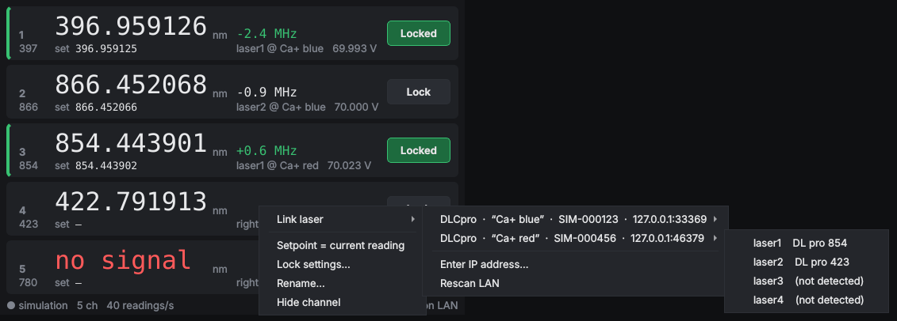

# SimpleWavemeterLock

A small, fast GUI to lock TOPTICA DL pro lasers (DLC pro controllers) to a
HighFinesse wavemeter. It replaces WAND for day-to-day locking: one window,
one row per active wavemeter channel, right-click to pick a laser, click to lock.



* **Active channels only**, each with its **vacuum wavelength to 9 significant
  digits** (computed from the measured frequency, so it does not depend on the
  air/vacuum setting of the WLM software), the deviation from the setpoint in MHz
  and the laser's scan offset.
* **Right-click a channel → Link laser** lists every DLC pro on the LAN (found the
  way TOPAS finds them, by UDP broadcast) with its serial number, system label
  and the lasers it drives (`laser1` … `laser4`). Pick one. **Enter IP
  address…** is there for controllers on another subnet.
* **Lock** runs a simple PI loop that only touches `laserN:scan:offset`.
* Fast by construction: the wavemeter is read in its own thread, all network I/O
  happens in one worker thread per controller (writes are coalesced, Nagle off),
  and the GUI only repaints numbers that changed. Nothing ever blocks the window.

## Install

Python ≥ 3.8 and one Qt binding (PySide6 preferred; PyQt5 and PyQt6 also work):

```
pip install PySide6 ifaddr
```

`ifaddr` is optional. It is used to broadcast on every network adapter; without it
discovery uses 255.255.255.255 only.

## Run

```
python -m wmlock                 # on the wavemeter PC: reads wlmData.dll directly (fastest)
python -m wmlock --http http://wavemeter-pc:8000   # anywhere else, via server/server.py
python -m wmlock --sim           # demo: simulated wavemeter + two fake DLC pros on localhost
```

The source you choose is remembered, so afterwards plain `python -m wmlock` or
double-clicking `wmlock.pyw` (Windows, no console window) is enough. Other options:
`--dll PATH` for a non-standard DLL location, `--channels 1,2,5` to override the
switch's channel list, `--config FILE` for a different settings file (default
`~/.simplewavemeterlock.json`).

The WLM software must be running, with the multichannel switch cycling over the
channels you want: the GUI never switches channels itself. It reads every
channel as soon as the WLM has a new result, and shows the channels ticked
"Use" in the switch settings.

## Use

| | |
|---|---|
| Right-click a channel | Link laser ▸ controller ▸ laserN, Enter IP address…, Rescan LAN, Unlink, Setpoint = current reading, Lock settings…, Rename…, Hide channel |
| **Lock** button | Engage or release. Without a setpoint it locks to the current reading. Green means locked; a red bar means it unlocked itself, and the reason is shown under the deviation. |
| `set` field | Setpoint as vacuum wavelength in nm. Type and press Enter, or put the cursor next to a digit and use ↑/↓ or the mouse wheel to step that digit. This works while locked, so you can walk the laser. |
| Double-click the name | Rename |
| Right-click empty space | Rescan LAN (F5), Show hidden channels, Always on top, Larger/smaller digits (Ctrl +/−) |

Greyed digits mean the channel has had no new reading for 3 s.

## The lock

On every **new** reading of a channel (never on stale data), with
`e = measured − setpoint` in GHz:

```
offset = offset_at_engage − (P·e + I·Σe)
```

* Gains are per reading, so the loop behaves the same whatever the switch cycle
  time is. Defaults: P = 0, I = 0.5 V/GHz. With a tuning coefficient K
  (GHz/V), I = 1/K corrects the whole error in one reading; about 0.3/K is a
  robust choice.
* **Sign**: positive gains assume the frequency rises with the offset. If a lock
  runs away, negate the gains in *Lock settings…*. In the `--sim` demo the
  866 nm laser is deliberately built the other way round, so you can watch the
  lock catch it.
* The lock is bumpless: it reads the present offset when you engage. Each reading
  moves the offset by at most *Max step* (0.25 V). The lock unlocks itself and
  says why if any of these happens:
  * the offset would leave *Min/Max offset* (0–140 V);
  * the offset would move more than *Max excursion* (±10 V) from where it was locked;
  * the error stays outside the *Capture range* (3 GHz, e.g. a mode hop) for 3 readings;
  * the controller stops answering.
* Invalid readings (low signal, overexposed, …) are skipped and the laser is
  left alone. Locks always start released when the program starts.

## Troubleshooting

* **No controllers in the menu**: discovery replies are UDP, so allow Python
  through the Windows firewall on the lab network (Windows asks on first run).
  Controllers behind a router won't hear the broadcast; use *Enter IP address…*,
  and they are remembered after that.
* **`cannot load wlmData`**: 64-bit Python needs the 64-bit `wlmData.dll`
  (System32), 32-bit Python the 32-bit one (SysWOW64). Point `--dll` at the
  right one if it isn't found.
* **Lock runs away straight after engaging**: the gain sign is wrong for that
  laser; negate P and I.

## Wavemeter server (optional)

`server/server.py` is the FastAPI server you already had, with one fix: it
called `GetUseChannel`, which wlmData does not have. That call always fell
back to "enabled", so every channel was reported. It now reports a channel only
when the switch actually uses it (`GetSwitcherSignalStates`). Same endpoint,
same JSON, so other clients keep working. Run it on the wavemeter PC next to
HighFinesse's `wlmData.py`/`wlmConst.py`:

```
pip install fastapi uvicorn
uvicorn server:app --host 0.0.0.0 --port 8000
```

## Layout

```
wmlock/wavemeter.py  wavemeter sources: wlmData.dll (ctypes), HTTP, push changes only
wmlock/dlcpro.py     DLC pro client (DeCoP command line, TCP 1998) + UDP discovery (60010)
wmlock/lock.py       the PI lock, pure maths
wmlock/engine.py     threads and state: source → lock → per-controller workers
wmlock/gui.py        Qt window
wmlock/sim.py        simulated wavemeter and fake DLC pros (demo and tests)
server/server.py     optional HTTP server for the wavemeter PC
```

The DLC pro protocol and discovery handshake follow TOPTICA's own Python SDK
(`toptica.lasersdk`), but the SDK is not needed.

## Tests

```
pip install pytest fastapi httpx
python -m pytest
```

The tests run the real discovery, protocol and lock code against the fake
controllers, and the GUI headless.
