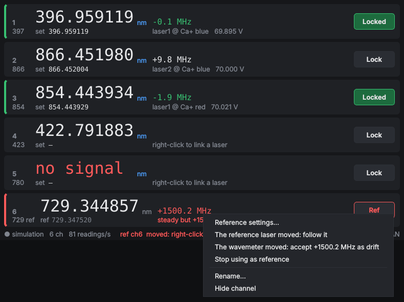

# SimpleWavemeterLock

A small, fast GUI to lock TOPTICA DL pro lasers (DLC pro controllers) to a
HighFinesse wavemeter. It replaces WAND for day-to-day locking: one window,
one row per active wavemeter channel, right-click to pick a laser, click to lock.


* **Active channels only**, each with its **vacuum wavelength to 9 significant
  digits** (computed from the measured frequency, so it does not depend on the
  air/vacuum setting of the WLM software), the deviation from the setpoint in MHz
  and the laser's scan offset.
* **Right-click a channel → Link laser** lists every DLC pro on the LAN (found the
  way TOPAS finds them, by UDP broadcast) with its serial number, system label
  and the lasers it drives (`laser1` … `laser4`). Pick one. **Enter IP
  address…** is there for controllers on another subnet.
* **Lock** runs a simple PI loop that only touches `laserN:scan:offset`.
* **Reference laser** (optional): a laser locked to a stable cavity corrects the
  wavemeter's drift for every other channel, and is ignored automatically while it
  mode-hops, unlocks or loses light.
* Fast by construction: the wavemeter is read in its own thread, all network I/O
  happens in one worker thread per controller (writes are coalesced, Nagle off),
  and the GUI only repaints numbers that changed. Nothing ever blocks the window.

## Install

Python ≥ 3.8 and one Qt binding (PySide6 preferred; PyQt5 and PyQt6 also work):

```
pip install PySide6 ifaddr
```

`ifaddr` is optional. It is used to broadcast on every network adapter; without it
discovery uses 255.255.255.255 only.

## Run

```
python -m wmlock                 # on the wavemeter PC: reads wlmData.dll directly (fastest)
python -m wmlock --http http://wavemeter-pc:8000   # anywhere else, via server/server.py
python -m wmlock --sim           # demo: simulated wavemeter, two fake DLC pros, a reference laser
```

The source you choose is remembered, so afterwards plain `python -m wmlock` or
double-clicking `wmlock.pyw` (Windows, no console window) is enough. Other options:
`--dll PATH` for a non-standard DLL location, `--channels 1,2,5` to override the
switch's channel list, `--config FILE` for a different settings file (default
`~/.simplewavemeterlock.json`).

The WLM software must be running, with the multichannel switch cycling over the
channels you want: the GUI never switches channels itself. It reads every
channel as soon as the WLM has a new result, and shows the channels ticked
"Use" in the switch settings.

## Use

| | |
|---|---|
| Right-click a channel | Link laser ▸ controller ▸ laserN, Enter IP address…, Rescan LAN, Unlink, Setpoint = current reading, Lock settings…, Use as reference laser, Rename…, Hide channel |
| **Lock** button | Engage or release. Without a setpoint it locks to the current reading. Green means locked; a red bar means it unlocked itself, and the reason is shown under the deviation. |
| `set` field | Setpoint as vacuum wavelength in nm. Type and press Enter, or put the cursor next to a digit and use ↑/↓ or the mouse wheel to step that digit. This works while locked, so you can walk the laser. |
| Double-click the name | Rename |
| Right-click empty space | Rescan LAN (F5), Show hidden channels, Always on top, Larger/smaller digits (Ctrl +/−); with `--sim`, Simulate a fault |

Greyed digits mean the channel has had no new reading for 3 s.

## The lock

On every **new** reading of a channel (never on stale data), with
`e = measured − setpoint` in GHz:

```
offset = offset_at_engage − (P·e + I·Σe)
```

* Gains are per reading, so the loop behaves the same whatever the switch cycle
  time is. Defaults: P = 0, I = 0.5 V/GHz. With a tuning coefficient K
  (GHz/V), I = 1/K corrects the whole error in one reading; about 0.3/K is a
  robust choice.
* **Sign**: positive gains assume the frequency rises with the offset. If a lock
  runs away, negate the gains in *Lock settings…*. In the `--sim` demo the
  866 nm laser is deliberately built the other way round, so you can watch the
  lock catch it.
* The lock is bumpless: it reads the present offset when you engage. Each reading
  moves the offset by at most *Max step* (0.25 V). The lock unlocks itself and
  says why if any of these happens:
  * the offset would leave *Min/Max offset* (0–140 V);
  * the offset would move more than *Max excursion* (±10 V) from where it was locked;
  * the error stays outside the *Capture range* (3 GHz, e.g. a mode hop) for 3 readings;
  * the controller stops answering.
* Invalid readings (low signal, overexposed, …) are skipped and the laser is
  left alone. Locks always start released when the program starts.

## Reference laser

If one of the lasers on the wavemeter is locked to a cavity that is more stable
than the wavemeter, right-click it and choose **Use as reference laser**. Its row
turns blue and shows the raw reading, where the reference should be (`ref`), and
the wavemeter's error and drift rate as measured on it. Every other channel is
then corrected for that error before display and before its lock acts; their `nm`
turns blue as a reminder, and the tooltip shows the raw reading. Locked lasers keep
a fixed relationship to the reference laser, however the wavemeter drifts, and
across restarts.



**How the correction works.** A Fizeau wavemeter's slow error is, to first order, the
same relative error ε on every channel. The reference sits at a fixed frequency F0,
so its reading F0·(1 + ε) measures ε, and each other reading f becomes f / (1 + ε).
(*Correction: the same offset for every laser* is an option in *Reference settings…*.)
F0 is wherever the reference is when you choose it, so nothing jumps. If you know the
reference laser's true wavelength (a comb, an atomic line), type it into *Reference
settings…*: every channel becomes absolutely calibrated, and locked lasers move to keep
their setpoints in that frame. The GUI asks first, and says by how much they will move.

**Why a misbehaving reference is ignored.** A reference that misbehaves jumps, sweeps,
runs away or goes dark. The wavemeter can do none of those: it only drifts, and slowly.
So:

* **Tracking.** The wavemeter's error and its rate are estimated with a critically
  damped α-β tracker (*Averaging time* 30 s). It follows real drift without lag.
* **Ignored readings.** A reading further than 6σ (at least 2 MHz) from the prediction
  is ignored. σ is the reference's own reading-to-reading scatter, which a slow
  runaway cannot inflate.
* **Hold.** Three such readings in a row, missing light, 10 s without readings, or an
  estimated rate above *Wavemeter drifts at most* (2 MHz/min) put the reference on
  **hold**. The correction is frozen there; for a slow runaway it is first wound back
  to before it started. Locks carry on with the frozen correction.
* **Resuming.** To be trusted again, the reference must produce a run of consistent
  readings. A straight-line fit over that run has to show that it is quiet and its
  slope is below the drift limit, within its own uncertainty. That takes about 10 s
  with a quiet wavemeter, longer with a noisy one. The run must also sit where the
  frozen correction expects it, give or take what the wavemeter can have drifted
  meanwhile (*drift limit × time*, at most *Largest drift over an outage*, 50 MHz). The
  difference is then taken up as wavemeter drift.
* **Moved.** If the reference comes back steady but somewhere else, e.g. on another
  cavity mode, the row turns red. The correction stays frozen until you right-click
  and decide:
  * *The reference laser moved: follow it*: nothing else moves.
  * *The wavemeter moved: accept … as drift*: locked lasers follow, and you are told
    by how much first.

Things to know:

* Set *Wavemeter drifts at most* comfortably above your wavemeter's real drift (WS7/WS8
  typically drift well under 0.5 MHz/min). Near the limit, proving "slower than the
  limit" takes long.
* A reference that unlocks but then drifts no faster than a wavemeter cannot be told
  apart from wavemeter drift by its readings alone.
* The WLM software's own auto-calibration steps the wavemeter's error. A step bigger than
  the gate shows up as *moved*: accept it as drift. Better, turn auto-calibration off,
  since the reference now does that job continuously.
* The reference's channel cannot be locked to the wavemeter; it is locked to its cavity.
* In `--sim`, channel 6 (729 nm) is a cavity-locked reference.
  *Right-click empty space ▸ Simulate a fault* gives it mode hops, a cavity unlock or a
  blocked beam, or steps the wavemeter, so you can watch all of the above happen.

## Troubleshooting

* **No controllers in the menu**: discovery replies are UDP, so allow Python
  through the Windows firewall on the lab network (Windows asks on first run).
  Controllers behind a router won't hear the broadcast; use *Enter IP address…*,
  and they are remembered after that.
* **`cannot load wlmData`**: 64-bit Python needs the 64-bit `wlmData.dll`
  (System32), 32-bit Python the 32-bit one (SysWOW64). Point `--dll` at the
  right one if it isn't found.
* **Lock runs away straight after engaging**: the gain sign is wrong for that
  laser; negate P and I.

## Wavemeter server (optional)

`server/server.py` is the FastAPI server you already had, with one fix: it
called `GetUseChannel`, which wlmData does not have. That call always fell
back to "enabled", so every channel was reported. It now reports a channel only
when the switch actually uses it (`GetSwitcherSignalStates`). Same endpoint,
same JSON, so other clients keep working. Run it on the wavemeter PC next to
HighFinesse's `wlmData.py`/`wlmConst.py`:

```
pip install fastapi uvicorn
uvicorn server:app --host 0.0.0.0 --port 8000
```

## Layout

```
wmlock/wavemeter.py  wavemeter sources: wlmData.dll (ctypes), HTTP, push changes only
wmlock/dlcpro.py     DLC pro client (DeCoP command line, TCP 1998) + UDP discovery (60010)
wmlock/lock.py       the PI lock, pure maths
wmlock/reference.py  wavemeter referencing to a cavity-locked laser, pure maths
wmlock/engine.py     threads and state: source → lock → per-controller workers
wmlock/gui.py        Qt window
wmlock/sim.py        simulated wavemeter and fake DLC pros (demo and tests)
server/server.py     optional HTTP server for the wavemeter PC
```

The DLC pro protocol and discovery handshake follow TOPTICA's own Python SDK
(`toptica.lasersdk`), but the SDK is not needed.

## Tests

```
pip install pytest fastapi httpx
python -m pytest
```

The tests run the real discovery, protocol, lock and reference code against the
fake controllers, and the GUI headless. The reference is tested on synthetic
mode hops, cavity unlocks, slow runaways, dark periods, wavemeter steps and
restarts. An end-to-end test checks that a locked laser's *true* frequency (known
to the simulator) stays put while the wavemeter drifts and the reference hops,
and moves when referencing is turned off.
